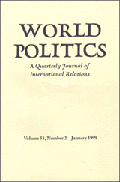
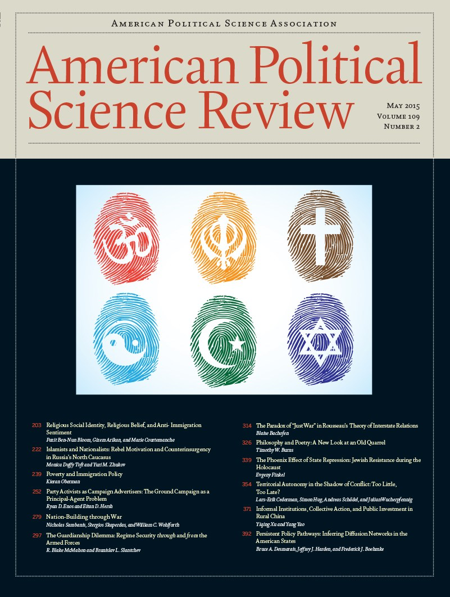
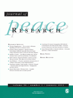
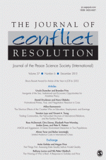
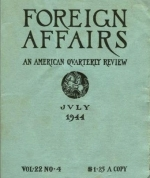
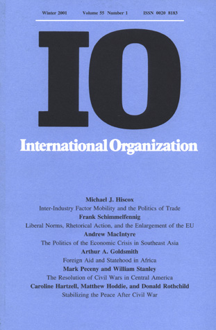
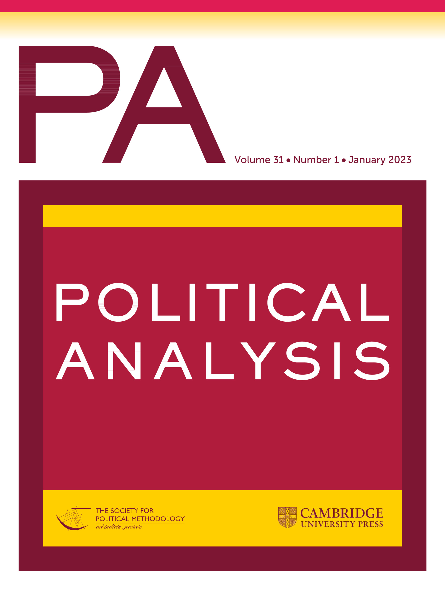
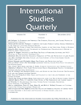

<!-- Google tag (gtag.js) -->

### Topics {#pubtop}
- [Legacies of Violence](#legacies)
- [Dynamics of Violence](#dynamics)
- [Causes of Violence](#causes)
- [International Security](#intl)
- [Sexual Violence](#sexual)
- [Geospatial Data Science](#data)
- [Reporting Bias in Event Data](#rep)

---
## Legacies of Violence {#legacies}
<a href="#pubtop">&#8593; back to top</a>

### Fighting for Tyranny: State Repression and Combat Motivation
 Rozenas, Arturas, Roya Talibova and Yuri M. Zhukov. "Fighting for Tyranny: State Repression and Combat Motivation." <em>American Economic Journal: Applied Economics</em> 16, no. 3 (2024): 44-75. <a href="https://doi.org/10.1257/app.20220085">doi.org/10.1257/app.20220085</a>
 
[Download preprint](../files/2023_RTZ.pdf) | [Publisher's version](https://doi.org/10.1257/app.20220085) | [Appendix](../files/2023_RTZ_appendix.pdf) | [Replication code and data](https://codeocean.com/capsule/8e4ad43e-639a-4dbc-aab1-241ff4086537/)
 

  
Abstract

  
  We utilize over 100 million declassified Red Army personnel records from World War II to study how state repression shapes soldiers' motivation to exert effort in fighting. Exploiting multiple complementary identification strategies, we find that soldiers from places with higher levels of pre-war repression under Stalin’s rule were more likely to fight until death and less likely to shirk their duties, but they also received fewer decorations for personal bravery. The coercive incentives created by repression appear to have induced obedience at the expense of initiative and increased the human costs of war.

### Never Again: The Holocaust and Political Legacies of Genocide
 Wayne, Carly and Yuri M. Zhukov. "Never Again: The Holocaust and Political Legacies of Genocide". <em>World Politics</em> 74, no. 3 (2022): 1-38. <a href="https://doi.org/10.1017/S0043887122000053">doi.org/10.1017/S0043887122000053</a>
 
[Download offprint](../files/2022_WZ_WP.pdf) | [Publisher's version](https://doi.org/10.1017/S0043887122000053) | [Appendix](https://static.cambridge.org/content/id/urn:cambridge.org:id:article:S0043887122000053/resource/name/S0043887122000053sup001.pdf) | [Replication code and data](https://doi.org/10.7910/DVN/ZAIGIN)
 

  
Abstract

  
  Do individuals previously targeted by genocide become more supportive of other victimized groups? How are these political lessons internalized and passed down across generations? To answer these questions, the authors leverage original survey data collected among Holocaust survivors in the United States and their descendants, Jews with no immediate family connection to the Holocaust, and non-Jewish Americans. They find that historical victimization is associated with increased support for vulnerable out-groups, generating stable political attitudes that endure across generations. Holocaust survivors are most supportive of aiding refugees, followed by descendants, especially those who grew up discussing the Holocaust with their survivor relatives. An embedded experiment demonstrates the steadfastness of these attitudes: unlike non-Jews or Jews without survivor relatives, survivors' and descendants' views toward refugees do not change after reading an in-group versus out-group–protective interpretation of the "never again" imperative. Histories of victimization can play an ameliorative role in intergroup relations.

### Historical Legacies of Political Violence
 Walden, Jacob and Yuri M. Zhukov. "Historical Legacies of Political Violence." <em>Oxford Research Encyclopedia of Politics</em> (2020). <a href="https://doi.org/10.1093/acrefore/9780190228637.013.1788">doi.org/10.1093/acrefore/9780190228637.013.1788</a>
 
[Download offprint](../files/2020_WZ_OEP.pdf) | [Publisher's version](https://doi.org/10.1093/acrefore/9780190228637.013.1788) 
 

  
Abstract

  
  Legacies of political violence are long-term changes in social behavior and attitudes, which are attributable -- at least in part -- to historical episodes of political conflict and contention. These legacies can potentially reshape the subsequent political and social order. Their catalysts can range from armed conflict, mass repression and genocide, to oppressive institutions and interpersonal violence. The lasting effects of violence include changes in political participation and preferences, intergroup relations, economic activity and growth, and public health outcomes. Estimating these effects presents a methodological challenge, due to selection, post-treatment bias and the difficulty of isolating specific mechanisms. These challenges are particularly acute give the long timespan inherent in studying historical legacies, where effects may be measured generations or centuries after the precipitating event. Understanding these legacies requires distinguishing between persistence mechanisms, where effects of violence continue within an individual directly exposed to violence through trauma, and the secondary transmission of effects between individuals through family socialization, community and peer influences, institutionalization, and epigenetic and evolutionary changes. Research on this subject remains nascent -- across many disciplines -- and inconclusive on whether violence fosters mostly negative or positive forms of social and political change.

### Mass Repression and Political Loyalty: Evidence from Stalin's 'Terror by Hunger'
 Rozenas, Arturas and Yuri M. Zhukov. "Mass Repression and Political Loyalty: Evidence from Stalin's 'Terror by Hunger'." <em>American Political Science Review</em> 133, no 2 (2019): 569-583. <a href="https://doi.org/10.1017/S0003055419000066">doi.org/10.1017/S0003055419000066</a>
 
[Download offprint](../files/2019_RZ_APSR.pdf) | [Publisher's version](https://doi.org/10.1017/S0003055419000066) | [Appendix](../files/2019_RZ_APSR_appendix.pdf) | [Replication code and data](https://doi.org/10.7910/DVN/XKMNAO)
 

  
Abstract

  
  States use repression to enforce obedience, but repression -- especially if it is violent, massive, and indiscriminate -- often incites opposition. Why does repression have such disparate effects? We address this question by studying the political legacy of Stalin's coercive agricultural policy and collective punishment campaign in Ukraine, which led to the death by starvation of over three million people in 1932-34. Using rich micro-level data on eight decades of local political behavior, we find that communities exposed to Stalin's "terror by hunger" behaved more loyally toward Moscow when the regime could credibly threaten retribution in response to opposition. In times when this threat of retribution abated, the famine-ridden communities showed more opposition to Moscow, both short and long-term. Thus, repression can both deter and inflame opposition, depending on the political opportunity structure in which post-repression behavior unfolds.

### Stalin's Terror and the Long-Term Political Effects of Mass Repression
 Zhukov, Yuri M. and Roya Talibova. "Stalin's Terror and the Long-Term Political Effects of Mass Repression." <em>Journal of Peace Research</em> 55, no. 2 (2018): 267-283. <a href="https://doi.org/10.1177/0022343317751261">doi.org/10.1177/0022343317751261</a>
 
[Download offprint](../files/2018_ZT_JPR.pdf) | [Publisher's version](https://doi.org/10.1177/0022343317751261) | [Appendix](../files/2018_ZT_JPR_appendix.pdf) | [Replication code and data](https://www.prio.org/utility/DownloadFile.ashx?id=8&type=replicationfile)
 

  
Abstract

  
  Repression has a long-term negative effect on political participation. Using millions of arrest records from archival documents, and polling-station level election results, we examine how exposure to Stalin-era repression affects voter turnout in Putin's Russia. To estimate the effect of repression on voting, we exploit exogenous variation in repression due to the structure of mid-century Soviet railroads, and travel distances to prison camps. We find that communities more heavily repressed under Stalin are less likely to vote today. The electoral legacy of Stalin's terror -- decades after the Soviet collapse, and across multiple election cycles (2003-2012) -- is systematically lower turnout. To show that our result is not unique to the Putin regime, we replicate our analysis in Ukraine (2004-2014), and find similar patterns. These results highlight the negative consequences of repression for political behavior, and challenge the emerging view that exposure to violence increases political engagement. While past research has emphasized the short-term effects of repression over several months or years, we show that these effects may be durable over generations and even changes of political regime. Our findings also demonstrate that repression need not be collective or indiscriminate to have community-level effects.

### The Political Legacy of Violence: The Long-Term Impact of Stalin's Repression in Ukraine
 Rozenas, Arturas, Sebastian Schutte and Yuri M. Zhukov. "The Political Legacy of Violence: The Long-Term Impact of Stalin's Repression in Ukraine". <em>Journal of Politics</em> 79, no 4 (2017): 1147-1161. <a href="http://dx.doi.org/10.1086/692964">dx.doi.org/10.1086/692964</a>
 
[Download offprint](../files/2017_RSZ_JOP.pdf) | [Publisher's version](https://doi.org/10.1177/0022343317751261) | [Appendix](../files/2017_RSZ_JOP_appendix.pdf) | [Replication code and data](https://doi.org/10.7910/DVN/ASLTVG)
 

  
Abstract

  
  Political scientists have long been interested in how indiscriminate violence affects the behavior of its victims, yet most research has focused on short term military consequences rather than long-term political effects. We argue that large scale violence can have an intergenerational impact on political preferences. Communities more exposed to indiscriminate violence in the past will -- in the future -- oppose political forces they associate with the perpetrators of that violence. We document evidence for this claim with archival data on Soviet state violence in western Ukraine, where Stalin's security services suppressed a nationalist insurgency by deporting over 250,000 people to Siberia. Using two causal identification strategies, we show that communities subjected to a greater intensity of deportation in the 1940's are now significantly less likely to vote for 'pro-Russian' parties. These findings show that indiscriminate violence systematically reduces long-term political support for the perpetrator.

---
## Dynamics of Violence {#dynamics}
<a href="#pubtop">&#8593; back to top</a>

### Near-Real Time Analysis of War and Economic Activity during Russia's Invasion of Ukraine
 Zhukov, Yuri M. "Near-Real Time Analysis of War and Economic Activity during Russia’s Invasion of Ukraine." <i>Journal of Comparative Economics</i> 51, no. 4 (2023): 1232-1243. <a href="https://doi.org/10.1016/j.jce.2023.06.003">doi.org/10.1016/j.jce.2023.06.003</a>
 
[Download offprint](../files/2023_Zhukov_JCE.pdf) | [Publisher's version](https://doi.org/10.1016/j.jce.2023.06.003) | [Appendix](../files/2023_Zhukov_JCE_appendix.pdf) | [Replication code and data]()
 

  
Abstract

  
  This paper introduces new near-real time data on Russia's full-scale invasion of Ukraine, and uses these data to investigate the short-term impact of occupation and violence on local economic activity. The data project -- VIINA (Violent Incident Information from News Articles) -- scrapes and parses news reports from Ukrainian and Russian media, georeferences them, and classifies them into standard event categories (e.g. air raid alert, artillery shelling) through machine learning. We show that VIINA has more comprehensive geographic coverage and more thorough documentation than any other open-source time event tracking system on Ukraine, and is the only such effort that includes information on territorial control. To illustrate potential applications of these data for research on political economy, we utilize remote sensing data on luminosity and vegetation as proxies for urban economic activity and agricultural land use. We find that economic activity declined most in urban areas that neither side fully controlled, and in places where artillery shelling was more intense. Contested territories also experienced a significant short-term decline in vegetation. Areas under Russian occupation, however, remained largely insulated from these negative shocks.

### Repression Works (just not in moderation)
 Zhukov, Yuri M. "Repression Works (just not in moderation)." <em>Comparative Political Studies</em> 56, no. 11 (2023): 1663-1694. <a href="https://doi.org/10.1177/00104140231152778">doi.org/10.1177/00104140231152778</a>
 
[Download offprint](../files/2023_Zhukov_CPS.pdf) | [Publisher's version](https://doi.org/10.1177/00104140231152778) | [Appendix](../files/2023_Zhukov_CPS_appendix.pdf) 
 

  
Abstract

  
  Why does government violence deter political challengers in one context, but inflame them in the next? This paper argues that repression increases opposition activity at low and moderate levels, but decreases it in the extreme. There is a threshold level of violence, where the opposition becomes unable to recruit new members, and the rebellion unravels -- even if the government is responsible for more civilian suffering overall. I show this result theoretically, with a mathematical model of coercion and popular support, and empirically, with micro-level data from Chechnya and a meta-analysis of sub-national conflict dynamics in 145 countries. The data suggest that such a threshold exists, but the level of violence needed to reach it varies. Many governments, thankfully, are unable or unwilling to go that far. I explore conditions under which this threshold may be higher or lower, and highlight a fundamental trade-off between reducing government violence and preserving civil liberties.

### External Resources and Indiscriminate Violence: Evidence from German-occupied Belarus
 Zhukov, Yuri M. "External Resources and Indiscriminate Violence: Evidence from German-occupied Belarus". <em>World Politics</em> 69, no. 1 (2017): 54-97. <a href="https://doi.org/10.1017/S0043887116000137">doi.org/10.1017/S0043887116000137</a>
 
[Download offprint](../files/2017_Zhukov_WP.pdf) | [Publisher's version](https://doi.org/10.1017/S0043887116000137) | [Appendix](../files/2017_Zhukov_WP_appendix.pdf) | [Replication code and data](http://dx.doi.org/10.7910/DVN/WLVZQH)
 

  
Abstract

  
  Within a single conflict, the scale of government violence against civilians can vary greatly – from mass atrocities in one village, to eerie restraint in the next. This article argues that the scale of anti-civilian violence depends on a combatant's relative dependence on local and external sources of support. External resources make combatants less dependent on the local population, but also create perverse incentives for how the population is to be treated. Efforts by the opposition to interdict the government's external resources can reverse this effect. This article tests this relationship with disaggregated archival data on German-occupied Belarus during World War Two. It finds that Soviet partisan attacks against German personnel provoked reprisals against civilians, but attacks against railroads had the opposite effect. Where partisans focused on disrupting German supply lines rather than killing Germans, occupying forces conducted fewer reprisals, burned fewer houses, and killed fewer people.

### Taking Away the Guns: Forcible Disarmament and Rebellion
 Zhukov, Yuri M. "Taking Away the Guns: Forcible Disarmament and Rebellion". <em>Journal of Peace Research</em>, 53, no. 2 (2016): 242-258. <a href="https://doi.org/10.1177/0022343315626241">doi.org/10.1177/0022343315626241</a>
 
[Download offprint](../files/2016_Zhukov_JPR.pdf) | [Publisher's version](https://doi.org/10.1177/0022343315626241) | [Appendix](../files/2016_Zhukov_JPR_appendix.pdf) | [Replication code and data](https://files.prio.org/Journals/JPR/2016/53/2/Yuri%20M%20Zhukov.zip)
 

  
Abstract

  
  If a government is facing an armed uprising, why doesn't it confiscate all privately-owned weapons? When and where is forcible disarmament most likely to occur? Can forcible disarmament reduce rebel activity? To establish a monopoly on the use of force, a government must either convince its citizens not to rebel, or remove their capacity to do so. Existing literature has left this choice -- between punishment and disarmament -- virtually unexplained. Most existing research focuses on disarmament in the context of post-conflict stabilization, rather than forcible disarmament during war. I introduce a mathematical model of irregular warfare, in which government and rebel forces seek a monopoly on violence. The model shows that disarmament occurs mainly in "hard cases," where otherwise strong governments are unable to punish opponents or reward supporters. I test these claims with declassified archival data on counterinsurgency in the Soviet North Caucasus. The data confirm that disarmament was most likely where the government's coercive leverage was limited -- due to poor intelligence and potential backlash from collateral damage. In these otherwise challenging circumstances, disarmament significantly reduced rebel violence -- short-term and long-term, locally and region-wide. By limiting the potential coercive resources under the opposition's control, disarmament can render rebels unable to sustain a campaign of violence against the state.

### On the Logistics of Violence
 Zhukov, Yuri M. "On the Logistics of Violence". In Charles H. Anderton and Jurgen Brauer, eds., <em>Economic Aspects of Genocides, Other Mass Atrocities, and Their Prevention</em>. (Oxford University Press, 2016).
 
[Download offprint](../files/2016_Zhukov_OUP.pdf)
 

  
Abstract

  This chapter explores how logistical costs shape the quantity and quality of violence against civilians. I distinguish between two types of supply systems: a reliance on local resources obtained from within a conflict zone, and external resources shipped from outside. All else equal, the intensity of violence against civilians should be greater where external resources are available at relative low cost. As the costs of obtaining external resources rise – due to poor infrastructure or sabotage – violence against civilians should decline. I evaluate the empirical evidence for these claims using disaggregated data on 58 low-intensity conflicts since 1997, and archival data on Stalin's Great Terror and killings of civilians by Nazi Germany in World War II.

### Islamists and Nationalists: Rebel Motivation and Counterinsurgency in Russia's North Caucasus 
 Toft, Monica Duffy and Yuri M. Zhukov. "Islamists and Nationalists: Rebel Motivation and Counterinsurgency in Russia's North Caucasus." <em>American Political Science Review</em> 109, no. 2 (2015): 222-238. <a href="https://doi.org/10.1017/S000305541500012X">doi.org/10.1017/S000305541500012X</a>
 
[Download offprint](../files/2015_TZ_APSR.pdf) | [Publisher's version](https://doi.org/10.1017/S000305541500012X) | [Appendix](../files/2015_TZ_APSR_appendix.pdf) | [Replication code and data](http://dx.doi.org/10.7910/DVN/DK4FXA)
 

  
Abstract

  
  This article offers the first disaggregated, quantitative comparison of Islamist and nationalist violence, using new data from Russia's North Caucasus. We find that violence by Islamist groups is less sensitive to government coercion than violence by nationalist groups. Selective counterinsurgency tactics outperform indiscriminate force in suppressing attacks by nationalists, but not Islamists. We attribute this finding to rebels' support structure. Because Islamist insurgents rely less on local support than nationalists, they are able to maintain operations even where it is relatively costly for the population to support them. These findings have potentially significant implications for other contemporary conflicts where governments face both types of challenges to their authority.

### Population Resettlement in War: Theory and Evidence from Soviet Archives
 Zhukov, Yuri M. "Population Resettlement in War: Theory and Evidence from Soviet Archives". <em>Journal of Conflict Resolution</em> 59, no 7 (2015): 1155-1185. <a href="http://dx.doi.org/10.1177/0022002713520590">dx.doi.org/10.1177/0022002713520590</a>
 
[Download offprint](../files/2015_Zhukov_JCR.pdf) | [Publisher's version](http://dx.doi.org/10.1177/0022002713520590) | [Appendix](../files/2015_Zhukov_JCR_appendix.pdf) | [Replication code and data](https://journals.sagepub.com/doi/suppl/10.1177/0022002713520590/suppl_file/Data_Set.zip)
 

  
Abstract

  
  Why do combatants intentionally uproot civilians? The forcible relocation of families and communities to concentration camps, "protected villages" and other special settlements is a regular feature of irregular war, occurring in almost a third of all counterinsurgency campaigns since 1816. Despite the historical regularity of these practices, most research has focused on individual decisions to flee, rather than the brute-force resettlement of civilians by combatants. Using a dynamic model of popular support and new micro-level data from Soviet secret police archives, I show that civilian resettlement is not simply a by-product of war, but is a rational response to informational asymmetry. Combatants who cannot identify and selectively punish their opponents face incentives to control the population rather than earn its support. For strong governments with limited coercive leverage, civilian resettlement offers a way to reduce rebel activity without having to win hearts and minds.

### Theory of Indiscriminate Violence.
 Zhukov, Yuri M. <em>Theory of Indiscriminate Violence.</em> Doctoral dissertation. Harvard University, 2014.
 
[Download offprint](../files/2014_Zhukov_Thesis.pdf)
 

  
Abstract

  
  Why do governments use indiscriminate violence against civilians? To deter a population from rebelling, a government should make rebellion costlier than neutrality. Yet indiscriminate violence can make neutrality costlier than rebellion. If indiscriminate violence causes previously passive actors to rebel, why do governments use it? With the help of mathematical modeling, archival data and micro-comparative evidence from dozens of armed conflicts, I show that combatants use indiscriminate violence because it works -- just not in moderation. Indiscriminate violence makes civilians less likely to remain neutral, but not necessarily more likely to support the opponent.There is a threshold level of violence, beyond which it becomes safer for civilians to cooperate with the more indiscriminate side. As long as civilians believe that supporting the rebels will be costlier than supporting the government, they will generally not rebel -- even if the government is responsible for more civilian deaths overall. The amount of violence needed to meet this threshold depends on the government' relative informational endowment. If a combatant has the information to selectively punish her opponents, she can employ a relatively low level of violence. Where she lacks the information for selective punishment, she will use methods more indiscriminate in targeting and more massive in scale. Violence is a substitute for intelligence.

### An Epidemic Model of Violence and Public Support in Civil War
 Zhukov, Yuri M. "An Epidemic Model of Violence and Public Support in Civil War". <em>Conflict Management and Peace Science</em> 30, no. 1 (2013): 24-52. <a href="http://dx.doi.org/10.1177/0738894212456936">dx.doi.org/10.1177/0738894212456936</a>
 
[Download offprint](../files/2013_Zhukov_CMPS.pdf) | [Publisher's version](http://dx.doi.org/10.1177/0738894212456936) 
 

  
Abstract

  
  If civil war is a contest for popular support, why would a government ever embark on a policy of disproportionate force and mass killing? The logic of civilian defection expects such an approach to easily backfire, as civilians respond to massive losses by opposing the side that inflicted them. Yet even if civilians balance against the side they believe most likely to kill them, massive violence can still occur and – when it does – is sometimes seen as a key source of success. Using an epidemic model of popular support dynamics, this paper derives a set of conditions under which mass killing can occur in civil war. Such conditions emerge when combatants have imperfect information about civilian defection, when learning is slow, or when one side initially enjoys an asymmetric advantage in levels of active support or flows of recruits.

### Roads and the Diffusion of Insurgent Violence: The Logistics of Conflict in Russia's North Caucasus
 Zhukov, Yuri M. "Roads and the Diffusion of Insurgent Violence: The Logistics of Conflict in Russia's North Caucasus". <em>Political Geography</em> 31, no. 3 (2012): 144-156. <a href="http://dx.doi.org/10.1016/j.polgeo.2011.12.002">dx.doi.org/10.1016/j.polgeo.2011.12.002</a>
 
[Download offprint](../files/2012_Zhukov_PG.pdf) | [Publisher's version](http://dx.doi.org/10.1016/j.polgeo.2011.12.002) | [Appendix](../files/2012_Zhukov_PG_appendix.pdf) | [Replication code and data](https://doi.org/10.7910/DVN/HPHDT0)
 

  
Abstract

  
  How does insurgency spread? Existing research on the diffusion of violence at the local level of civil war tends to under-specify the theoretical mechanisms by which conflict can be expanded, relocated or sustained, and overlooks the real-world logistical constraints that combatants face on a daily basis. This paper attempts to address both problems by taking a closer look at the role of road networks in the diffusion of insurgent activity. By explicating the logic of diffusion in a simple epidemic model and exploiting new disaggregated data on violence and road networks in the North Caucasus, this analysis challenges the conventional view that insurgent logistics are either self-sufficient or highly flexible. Roads shape the costs of sustaining and expanding operations, which facilitates the transmission of violence to new locations, but can also intensify competition for limited military resources between nearby battlefronts. At the local level, this dynamic makes the relocation of insurgent activity more likely than its expansion. Methodologically, this paper demonstrates that a failure to account for logistical constraints in the empirical study of civil war can bias downward the estimated costs of diffusion and overpredict the transmissibility of violence between neighboring locations. The use of road network distances can yield more conservative inferences and more accurate predictions of how violence spreads.

### Denial and Punishment in the North Caucasus: Evaluating the Effectiveness of Coercive Counterinsurgency
 Toft, Monica Duffy, and Yuri M Zhukov. "Denial and Punishment in the North Caucasus: Evaluating the Effectiveness of Coercive Counterinsurgency". <em>Journal of Peace Research</em> 49, no. 6 (2012): 785-800. <a href="http://dx.doi.org/10.1177/0022343312448389">dx.doi.org/10.1177/0022343312448389</a>
 
[Download offprint](../files/2012_TZ_JPR.pdf) | [Publisher's version](http://dx.doi.org/10.1177/0022343312448389) | [Appendix](../files/2012_TZ_JPR_appendix.pdf) | [Replication code and data](https://file.prio.no/journals/JPR/2012/49/6/Toft_Zhukov/Toft_Zhukov_2012.zip)
 

  
Abstract

  
  A growing literature on the subnational diffusion of armed conflict rests on the proposition that political violence triggers more violence, in the same locality and elsewhere. Yet state efforts to contain such uprisings remain largely unexplored, theoretically and empirically. Drawing on a mathematical model of epidemics, we formalize the logic of conflict diffusion and derive conditions under which state coercion might limit the spread of insurgent violence. Using a new dataset of insurgent and government violence in Russia's North Caucasus from 2000-2008, we evaluate the relative effectiveness of four coercive strategies: (1) denial, which manipulates the costs of expanding insurgent activity to new locations, (2) punishment, which manipulates the costs of sustained fighting in contested areas, (3) denial and punishment, which does both, and (4) no action, which does neither. We find denial to be most effective at containing insurgent violence. Punishment is least effective, and even counterproductive. Not only does such a strategy fail to prevent the spillover of violence to new locations, but it may amplify the risk of continued fighting in contested areas. In the Caucasus, denial is found to be the least inflammatory counterinsurgency option for Russia. For it to succeed, Russia should physically isolate centers of insurgent activity from regions of non-violence and avoid the temptation of punitive reprisals.

### Counterinsurgency in a Non-Democratic State: The Russian Example
 Zhukov, Yuri M. "Counterinsurgency in a Non-Democratic State: The Russian Example". In <em>The Routledge Handbook of Insurgency and Counterinsurgency</em>. London: Routledge, 2012.
 
[Download offprint](../files/2012_Zhukov_Routledge.pdf)
 

### Examining the Authoritarian Model of Counter-insurgency: The Soviet Campaign Against the Ukrainian Insurgent Army
 Zhukov, Yuri M. "Examining the Authoritarian Model of Counter-insurgency: The Soviet Campaign Against the Ukrainian Insurgent Army". <em>Small Wars and Insurgencies</em> 18, no. 3 (2007): 439-466.
 
[Download offprint](../files/2007_Zhukov_SWI.pdf)
 

  
Abstract

  
  In an effort to better understand the benefits and limitations of an authoritarian approach to counter-insurgency, this article examines the relationship between regime type and military effectiveness in the often neglected case of Soviet counter-insurgency operations in Western Ukraine. This study finds that the advantages authoritarian governments enjoy in designing, planning and implementing counter-insurgency campaigns - related to a lack of restraints and constraints - can all too easily become reversed through the excesses they permit.

---
## Causes of Violence {#causes}
<a href="#pubtop">&#8593; back to top</a>

### Trading Hard Hats for Combat Helmets: The Economics of Rebellion in Eastern Ukraine
 Zhukov, Yuri M. "Trading Hard Hats for Combat Helmets: The Economics of Rebellion in Eastern Ukraine". <em>Journal of Comparative Economics</em> 44, no. 1 (2016): 1-15. <a href="http://dx.doi.org/10.1016/j.jce.2015.10.010">dx.doi.org/10.1016/j.jce.2015.10.010</a>
 
[Download offprint](../files/2016_Zhukov_JCE.pdf) | [Publisher's version](http://dx.doi.org/10.1016/j.jce.2015.10.010) | [Appendix](../files/2016_Zhukov_JCE_appendix.pdf) | [Replication code and data](http://dx.doi.org/10.7910/DVN/4VAHBW)
 

  
Abstract

  
  Using new micro-level data on violence in Eastern Ukraine, this paper evaluates the relative merits of ‘identity-based' and ‘economic' explanations of civil conflict. The first view expects rebellion to be most likely in areas home to the geographic concentration of ethnolinguistic minorities. The second expects more rebel activity where the opportunity costs of insurrection are low. Evidence from the armed conflict in Ukraine supports the second view more than the first. A municipality's prewar employment mix is a more robust predictor of rebel activity than local ethnolinguistic composition. Municipalities more exposed to trade shocks with Russia experienced a higher intensity of rebel violence throughout the conflict. Such localities also fell under rebel control earlier – and took longer for the government to liberate – than municipalities where the labor force was less dependent on exports to Russia.

### Rust Belt Rising: The Economics Behind Eastern Ukraine's Upheaval
 Zhukov, Yuri M. "Rust Belt Rising: The Economics Behind Eastern Ukraine's Upheaval". <em>Foreign Affairs</em>, 2014.
 
[Publisher's version](http://www.foreignaffairs.com/articles/141561/yuri-m-zhukov/rust-belt-rising)
 

  
Abstract

  
  International observers have tended to paint the armed conflict in eastern Ukraine as an ethnic dispute, engineered and coordinated by Moscow. Yet by attributing the conflict's causes and solutions to forces outside Ukraine, the West and Kiev risk misdiagnosing the ailment and writing the wrong prescription. Preliminary data suggest that the rebellion is more local than international, and that its domestic roots are more economic than ethnic.

---
## International Security {#intl}
<a href="#pubtop">&#8593; back to top</a>

### Until the Bitter End? The Diffusion of Surrender Across Battles
 Lehmann, Todd and Yuri M. Zhukov. "Until the Bitter End? The Diffusion of Surrender Across Battles." <em>International Organization</em> 73, no. 1 (2019): 133-169. <a href="https://doi.org/10.1017/S0020818318000358">doi.org/10.1017/S0020818318000358</a>
 
[Download offprint](../files/2019_LZ_IO.pdf) | [Publisher's version](https://doi.org/10.1017/S0020818318000358) | [Replication code and data](https://static.cambridge.org/content/id/urn:cambridge.org:id:article:S0020818318000358/resource/name/S0020818318000358sup001.zip)
 

  
Abstract

  
  Why do armies sometimes surrender to the enemy and sometimes fight to the bitter end? Existing research has highlighted the importance of battlefield resolve for the onset, conduct and outcome of war, but has left these life-and-death decisions mostly unexplained. We know little about why battle-level surrender occurs, and why it stops. In this paper, we argue that surrender emerges from a collective action problem: success in battle requires that soldiers choose to fight as a unit rather than flee, but individual decisions to fight depend on whether soldiers expect their comrades to do the same. As a result, surrender becomes contagious across battles, as soldiers take cues from what other soldiers had done when they were in a similar position. Where no recent precedent exists, mass surrender is unlikely. We find empirical support for this claim using a new dataset of conventional battles in all interstate wars from 1939 to 2011. These findings advance our understanding of battlefield resolve, with broader implications for the design of political-military institutions and decisions to initiate, continue, and terminate war.

### Invisible Digital Front: Can Cyber Attacks Shape Battlefield Events?
 Kostyuk, Nadiya and Yuri M. Zhukov. "Invisible Digital Front: Can Cyber Attacks Shape Battlefield Events?" <em>Journal of Conflict Resolution</em> 63, no. 2 (2019): 317-347. <a href="https://doi.org/10.1177/0022002717737138">doi.org/10.1177/0022002717737138</a>
 
[Download offprint](../files/2019_KZ_JCR.pdf) | [Publisher's version](https://doi.org/10.1177/0022002717737138) | [Appendix 1](../files/2019_KZ_JCR_appendix1.pdf) | [Appendix 2](../files/2019_KZ_JCR_appendix2.pdf) | [Replication code and data](https://journals.sagepub.com/doi/suppl/10.1177/0022002717737138/suppl_file/jcr-17-0021.r2_replication.zip)
 

  
Abstract

  
  Recent years have seen growing concern over the use of cyber attacks in wartime, but little evidence that these new tools of coercion can change battlefield events. We present the first quantitative analysis of the relationship between cyber activities and physical violence during war. Using new event data from the armed conflict in Ukraine -- and additional data from Syria's civil war -- we analyze the dynamics of cyber attacks, and find that such activities have had little or no impact on fighting. In Ukraine -- one of the first armed conflicts where both sides deployed such tools extensively -- cyber activities failed to compel discernible changes in battlefield behavior. Indeed, hackers on both sides have had difficulty responding to battlefield events, much less shaping them. An analysis of conflict dynamics in Syria produces similar results: the timing of cyber actions is independent of fighting on the ground. Our finding -- that cyber attacks are not (yet) effective as tools of coercion in war -- has potentially significant implications for other armed conflicts with a digital front.

### NATO's Mediterranean Mission: What the Alliance is Doing in the Aegean Sea
 Zhukov, Yuri M. "NATO's Mediterranean Mission: What the Alliance is Doing in the Aegean Sea". <em>Foreign Affairs</em>, 2016.
 
[Publisher's version](https://www.foreignaffairs.com/articles/europe/2016-02-21/natos-mediterranean-mission)
 

  
Abstract

  
  NATO's response to the migrant crisis has been met with criticism on both humanitarian and utilitarian grounds. The first critique is that military efforts to slow or reverse the refugee flow will lead to unnecessary human suffering. The second critique is that NATO's operation will do little or nothing to deter people-smuggling, and may even encourage more of it. In fact, the operation's humanitarian impact is unlikely to be as dire as skeptics predict. Doubts about NATO's ability to stem illegal migration, however, will linger for some time—unless the alliance significantly expands the scope of its new mission.

### Egypt's Gift from God: What the Discovery of Offshore Gas Means for Cairo
 Zhukov, Yuri M. "Egypt's Gift from God: What the Discovery of Offshore Gas Means for Cairo". <em>Foreign Affairs</em>, 2015.
 
[Publisher's version](https://www.foreignaffairs.com/articles/cyprus/2015-09-23/egypts-gift-god)
 

  
Abstract

  
  On August 30, the Italian state-controlled energy company Eni announced the discovery of a "supergiant" gas field off the coast of Egypt. According to initial assessments, the Zohr field contains 30 trillion cubic feet (Tcf) of natural gas (equivalent to 5.5 billion barrels of oil), making it the largest ever discovery of gas in the Mediterranean. This is welcome news for Egypt's struggling economy and fragile political situation. It also creates new challenges and opportunities for the country's neighbors and for outside powers such as Vladimir Putin's Russia. Additionally, it provides powerful economic incentives for Cypriot reunification. As the United States takes stock of what Egypt's good fortune means for the region, it should find much cause for celebration.

### More Trouble in the Eastern Mediterranean: U.S. Intervention or Not, the Sea is Already Boiling
 Zhukov, Yuri M. "More Trouble in the Eastern Mediterranean: U.S. Intervention or Not, the Sea is Already Boiling". <em>Foreign Affairs</em>, 2013.
 
[Publisher's version](http://www.foreignaffairs.com/articles/139900/yuri-m-zhukov/more-trouble-in-the-eastern-mediterranean)
 

  
Abstract

  
  So far, public debate about the intervention in Syria has centered on the immediate scope and aims of any U.S.-led military operation, and whether the U.S. Congress should be involved. But no matter how the possible intervention and its aftermath play out, one thing is certain: the eastern Mediterranean -- where exploratory drilling has unearthed vast reserves of natural gas, and where competition over the rights to tap those resources is already fierce -- will become less stable.

### Cyprus and Russia Did Not Just Break Up: Why Moscow Is Playing the Long Game on the Island of Aphrodite
 Zhukov, Yuri M. "Cyprus and Russia Did Not Just Break Up: Why Moscow Is Playing the Long Game on the Island of Aphrodite". <em>Foreign Affairs</em>, 2013.
 
[Publisher's version](http://www.foreignaffairs.com/articles/139090/yuri-m-zhukov/cyprus-and-russia-did-not-just-break-up)
 

  
Abstract

  
  Russia recently turned down a deal to save Cyprus' banking sector. At first glance, the move looked like a huge strategic blunder. In fact, a credible offer was never on the table and Moscow needs no accord to secure its dominance on the island.

### Trouble in the Eastern Mediterranean Sea: The Coming Dash for Gas
 Zhukov, Yuri M. "Trouble in the Eastern Mediterranean Sea: The Coming Dash for Gas". <em>Foreign Affairs</em>, 2013.
 
[Publisher's version](http://www.foreignaffairs.com/articles/139069/yuri-m-zhukov/trouble-in-the-eastern-mediterranean-sea) |
 

  
Abstract

  
  Exploratory drilling near the coasts of Cyprus, Egypt, Israel, Lebanon, Syria, and Turkey has unearthed vast reserves of natural gas. Competition over the rights to tap those resources is compounding existing tensions over sovereignty and maritime borders. The eastern Mediterranean is quickly becoming as volatile as its eastern cousin, the South China Sea.

### Use of Force and Civil-Military Relations in Russia: An Automated Content Analysis
 Stewart, Brandon M, and Yuri M Zhukov. "Use of Force and Civil-Military Relations in Russia: An Automated Content Analysis". <em>Small Wars and Insurgencies</em> 20, no. 2 (2009): 319-343.
 
[Download offprint](../files/2009_SZ_SWI.pdf) | [Replication code and data](http://dx.doi.org/10.7910/DVN/23111)
 

  
Abstract

  
  Russia's intervention in the Georgian-South Ossetian conflict has highlighted the need to rigorously examine trends in the public debate over the use of force in Russia. Approaching this debate through the prism of civil-military relations, we take advantage of recent methodological advances in automated content analysis and generate a new dataset of 8000 public statements made by Russia's political and military leaders during the Putin period. The data show little evidence that military elites exert a restraining influence on Russian foreign and defence policy. Although more hesitant than their political counterparts to embrace an interventionist foreign policy agenda, Russian military elites are considerably more activist in considering the use of force as an instrument of foreign policy.

### The Cold War at Sea: An International Appraisal
 Goldstein, Lyle J, John B Hattendorf, and Yuri M Zhukov. "The Cold War at Sea: An International Appraisal". <em>The Journal of Strategic Studies</em> 28, no. 2 (2005): 151-156. <a href="http://dx.doi.org/10.1080/01402390500088221">dx.doi.org/10.1080/01402390500088221</a>
 
[Download offprint](../files/2005_GHZ_JSS.pdf) | [Publisher's version](http://dx.doi.org/10.1080/01402390500088221) 
 

### The Evolution of the U.S. Navy's Maritime Strategy in the Context of Major Political and Military Events of the Cold War, 1964–1991
 Zhukov, Yuri M, and John B Hattendorf. "The Evolution of the U.S. Navy's Maritime Strategy in the Context of Major Political and Military Events of the Cold War, 1964–1991". In <em>The Evolution of the U.S. Navy's Maritime Strategy</em>, 1977- 1986. Vol. 19. Newport, RI: Naval War College Press, 2004.
 
[Download offprint](../files/2004_ZH_NWC.pdf)
 

<!-- ### Addressing Pipeline Security Challenges in Russia
 Zhukov, Yuri M. "Addressing Pipeline Security Challenges in Russia". <em>Eurasianet.org</em>, 2006.
 
| [Download offprint](http://scholar.harvard.edu/zhukov/publications/addressing-pipeline-security-challenges-russia) | 
 
 -->
### A Tale of Two Fleets: a Russian Perspective on the 1973 Naval Standoff in the Mediterranean
 Goldstein, Lyle J, and Yuri M Zhukov. "A Tale of Two Fleets: a Russian Perspective on the 1973 Naval Standoff in the Mediterranean". <em>Naval War College Review</em> 58, no. 2 (2004): 27-63.
 
[Download offprint](../files/2004_GZ_NWCR.pdf)
 

### Superpower Showdown in the Mediterranean 1973
Goldstein, Lyle J, and Yuri M Zhukov. "Superpower Showdown in the Mediterranean 1973". <em>Sea Power</em>, 2003.
<!--  
| [Download offprint](http://scholar.harvard.edu/zhukov/publications/superpower-showdown-mediterranean-1973) | 
 
 -->

---
## Sexual Violence {#sexual}
<a href="#pubtop">&#8593; back to top</a>

### Does Rape Culture Predict Rape? Evidence from U.S. Newspapers, 2000-2013
 Baum, Matthew A., Dara Kay Cohen and Yuri M. Zhukov. "Does Rape Culture Predict Rape? Evidence from U.S. Newspapers, 2000-2013." <em>Quarterly Journal of Political Science</em> 13, no. 3 (2018): 263-289.
 
[Download offprint](../files/2018_BCZ_QJPS.pdf) | [Publisher's version](http://dx.doi.org/10.1561/100.00016124) | [Appendix](../files/2018_BCZ_QJPS_appendix.pdf) | [Replication code and data](https://www.nowpublishers.com/article/details/supplementary-info/100.00016124_supp.zip)
 

  
Abstract

  
  We offer the first quantitative analysis of rape culture in the United States. Observers have long worried that biased news coverage of rape -- which blames victims, empathizes with perpetrators, implies consent, and questions victims' credibility - may deter victims from coming forward, and ultimately increase the incidence of rape. We present a theory of how rape culture might shape the preferences and choices of perpetrators, victims and law enforcement, and test this theory with data on news stories about rape published in U.S. newspapers between 2000 and 2013. We find that rape culture in the media predicts both the frequency of rape and its pursuit through the local criminal justice system. In jurisdictions where rape culture was more prevalent, there were more documented rape cases, but authorities were less vigilant in pursuing them.

---
## Geospatial Data Science {#data}
<a href="#pubtop">&#8593; back to top</a>

### Integrating Data Across Misaligned Spatial Units
 Zhukov, Yuri M., Jason S. Byers, Marty Davidson, Ken Kollman. "Integrating Data Across Misaligned Spatial Units." <i>Political Analysis</i> 32, no. 1 (2024): 17-33. <a href="https://doi.org/10.1017/pan.2023.5">doi.org/10.1017/pan.2023.5</a>
 
[Download offprint](../files/2023_ZBDK_PA.pdf) | [Publisher's version](https://doi.org/10.1017/pan.2023.5) | [Replication code and data](https://doi.org/10.7910/DVN/TOSX7N)
 

  
Abstract

  
  Theoretical units of interest often do not align with the spatial units at which existing data are available. This problem is pervasive in social science, particularly in sub-national empirical research that routinely requires integrating data across incompatible geographic units (e.g. administrative areas, electoral constituencies, postal codes). Overcoming this challenge requires researchers to not only align the scale of empirical and theoretical units, but also to diagnose the costs and consequences of alternative spatial transformation methods. We propose a framework for addressing such change-of-support problems in social science. We investigate the relative performance of 12 spatial transformation methods, including overlays, interpolation, kriging and other model-based approaches, using election data and Monte Carlo simulations. We show that both the accuracy of transformed values and the estimation of regression coefficients depend on the relative scale of source and destination units (i.e. aggregation, disaggregation, hybrid) and their degree of nesting (i.e. whether source units fall completely and neatly inside destination units). We propose simple nonparametric measures of relative scale and nesting, and validation procedures to assess the quality of the transformed geospatial data. Additionally, we introduce new infrastructure and open-source software to elucidate the consequences of these choices, and to make transformation options more accessible, customizable, and intuitive.

### Promoting Data Harmonization to Evaluate Vaccine Hesitancy in LMICs: Approach and Applications
 Rego, Ryan T., Yuri Zhukov, Kyrani A. Reneau, Amy Pienta, Kristina L. Rice, Patrick Brady, Geoffrey H. Siwo, Peninah Wanjiku Wachira, Amina Abubakar, Ken Kollman and Akbar K. Waljee . "Promoting Data Harmonization to Evaluate Vaccine Hesitancy in LMICs: Approach and Applications." <i>BMC Medical Research Methodology</i> 23, no. 278 (2023). <a href="https://doi.org/10.1186/s12874-023-02088-z">doi.org/10.1186/s12874-023-02088-z</a>
 
[Publisher's version](https://doi.org/10.1186/s12874-023-02088-z) 
 

  
Abstract

  
  Factors influencing the health of populations are subjects of interdisciplinary study. However, datasets relevant to public health often lack interdisciplinary breath. It is difficult to combine data on health outcomes with datasets on potentially important contextual factors, like political violence or development, due to incompatible levels of geographic support; differing data formats and structures; differences in sampling procedures and wording; and the stability of temporal trends. We present a computational package to combine spatially misaligned datasets, and provide an illustrative analysis of multi-dimensional factors in health outcomes.

### xSub: A new portal for cross-national data on sub-national violence
 Zhukov, Yuri M., Christian Davenport and Nadiya Kostyuk. "xSub: A new portal for cross-national data on sub-national violence." <em>Journal of Peace Research</em> 56, no. 4 (2019): 604-614. <a href="https://doi.org/10.1177/0022343319836697">doi.org/10.1177/0022343319836697</a>
 
[Download offprint](../files/2019_ZDK_JPR.pdf) | [Publisher's version](https://doi.org/10.1177/0022343319836697) | [Appendix](../files/Appendix_xSub_DataArticle_20190129_3.pdf) | [Replication code and data](https://www.prio.org/utility/DownloadFile.ashx?id=94&type=replicationfile)
 

  
Abstract

  
  Researchers today have access to an unprecedented amount of geo-referenced, disaggregated data on political conflict. Because these new data sources use disparate event typologies and units of analysis, findings are rarely comparable across studies. As a result, we are unable to answer basic questions like "what does conflict A tell us about conflict B?" This article introduces xSub -- a "database of databases" for disaggregated research on political conflict (<a href="http://www.x-sub.org">www.x-sub.org</a>). xSub reduces barriers to comparative sub-national research, by empowering researchers to quickly construct custom, analysis-ready datasets. xSub currently features sub-national data on conflict in 156 countries, from 21 sources, including large data collections and data from individual scholars. To facilitate comparisons across countries and sources, xSub organizes these data into consistent event categories, actors, spatial units (country, province, district, grid cell, electoral constituency) and time units (year, month, week and day). This article introduces xSub and illustrates its potential, by investigating the impact of repression on dissent across thousands of sub-national datasets.

### Choosing Your Neighbors: Networks of Diffusion in International Relations
 Zhukov, Yuri M, and Brandon M Stewart. "Choosing Your Neighbors: Networks of Diffusion in International Relations". <em>International Studies Quarterly</em>, no. 57 (2013): 271-287 <a href="http://dx.doi.org/10.1111/isqu.12008">dx.doi.org/10.1111/isqu.12008</a>
 
[Download offprint](../files/2013_ZS_ISQ.pdf) | [Publisher's version](https://doi.org/10.1111/isqu.12008) | [Replication code and data](https://doi.org/10.7910/DVN/GDKLGN)
 

  
Abstract

  
  In examining the diffusion of social and political phenomena like regime transition, conflict, and policy change, scholars routinely make choices about how proximity is defined and which neighbors should be considered more important than others. Since each specification offers an alternative view of the networks through which diffusion can take place, one's decision can exert a significant influence on the magnitude and scope of estimated diffusion effects. This problem is widely recognized, but is rarely the subject of direct analysis. In international relations research, connectivity choices are usually ad hoc, driven more by data availability than by theoretically informed decision criteria. We take a closer look at the assumptions behind these choices, and propose a more systematic method to asses the structural similarity of two or more alternative networks, and select one that most plausibly relates theory to empirics. We apply this method to the spread of democratic regime change, and offer an illustrative example of how neighbor choices might impact predictions and inferences in the case of the 2011 Arab Spring.

---
## Reporting Bias in Event Data {#rep}
<a href="#pubtop">&#8593; back to top</a>

### Media Ownership and News Coverage of International Conflict
 Baum, Matthew A. and Yuri M. Zhukov. "Media Ownership and News Coverage of International Conflict" <em>Political Communication</em> 31, no. 1 (2019): 36-53.
 
[Download offprint](../files/2019_BZ_PC.pdf) | [Publisher's version](https://doi.org/10.1080/10584609.2018.1483606) | [Appendix](../files/2019_BZ_PC_appendix.pdf) | [Replication code and data](https://www.tandfonline.com/doi/suppl/10.1080/10584609.2018.1483606/suppl_file/upcp_a_1483606_sm8852.zip)
 

  
Abstract

  
  How do differences in ownership of media enterprises shape news coverage of international conflict? We examine this relationship using a new dataset of 591,532 articles on US-led multinational military operations in Libya, Iraq, Afghanistan and Kosovo, published by 2,505 newspapers in 116 countries. We find that ownership chains exert a homogenizing effect on the content of newspapers' coverage of foreign policy, resulting in coverage across co-owned papers that is more similar in scope (what they cover), focus (how much "hard" relative to "soft" news they offer), and diversity (the breadth of topics they include in their coverage of a given issue) relative to coverage across papers that are not co-owned. However, we also find that competitive market pressures can mitigate these homogenizing effects, and incentivize co-owned outlets to differentiate their coverage. Restrictions on press freedom have the opposite impact, increasing the similarity of coverage within ownership chains.

### Filtering revolution: Reporting bias in international newspaper coverage of the Libyan civil war
 Baum, Matthew A. and Yuri M Zhukov. "Filtering revolution: Reporting bias in international newspaper coverage of the Libyan civil war." <em>Journal of Peace Research</em> 52, no. 3 (2015): 384-400. <a href="http://dx.doi.org/10.1177/0022343314554791">dx.doi.org/10.1177/0022343314554791</a>
 
[Download offprint](../files/2015_BZ_JPR.pdf) | [Publisher's version](http://dx.doi.org/10.1177/0022343314554791) | [Appendix](../files/2015_BZ_JPR_appendix.pdf) | [Replication code and data](https://file.prio.no/journals/JPR/2015/52/3/Baum%20&%20Zhukov%202015%20replication.zip)
 

  
Abstract

  
  Reporting bias – the media's tendency to systematically underreport or overreport certain types of events – is a per- sistent problem for participants and observers of armed conflict. We argue that the nature of reporting bias depends on how news organizations navigate the political context in which they are based. Where government pressure on the media is limited – in democratic regimes – the scope of reporting should reflect conventional media preferences toward novel, large-scale, dramatic developments that challenge the conventional wisdom and highlight the unsus- tainability of the status quo. Where political constraints on reporting are more onerous – in non-democratic regimes – the more conservative preferences of the state will drive the scope of coverage, emphasizing the legiti- macy and inevitability of the prevailing order. We test these propositions using new data on protest and political violence during the 2011 Libyan uprising and daily newspaper coverage of the Arab Spring from 113 countries. We uncover evidence of a status-quo media bias in non-democratic states, and a revisionist bias in democratic states. Media coverage in non-democracies underreported protests and nonviolent collective action by regime opponents, largely ignored government atrocities, and overreported those caused by rebels. We find the opposite patterns in democratic states.

